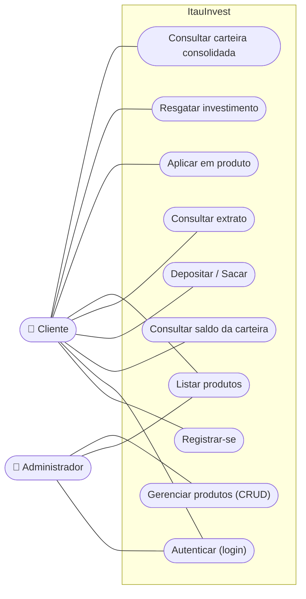
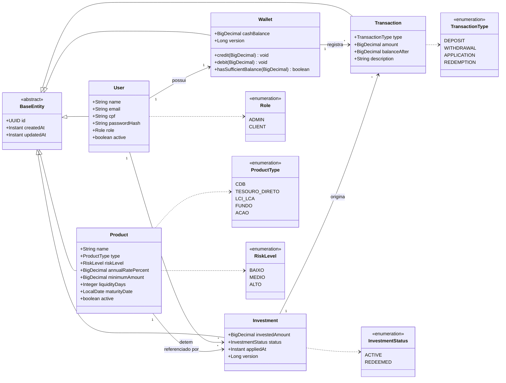
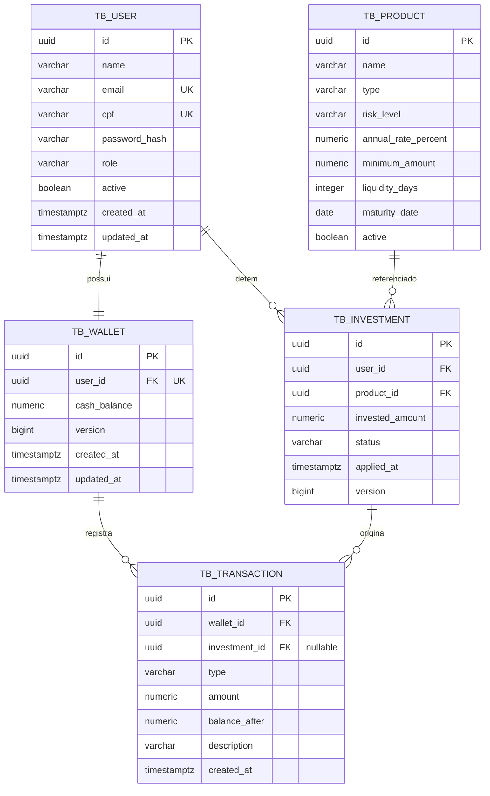
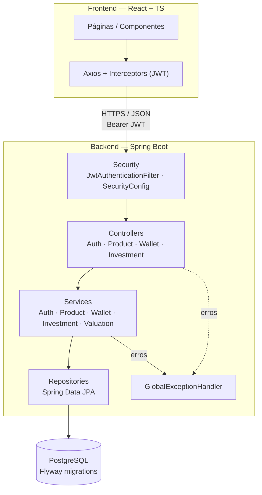
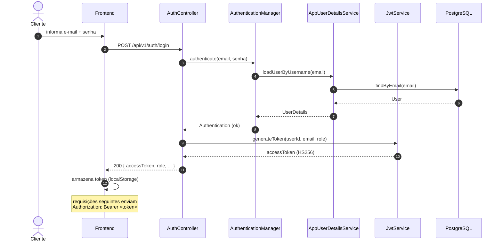
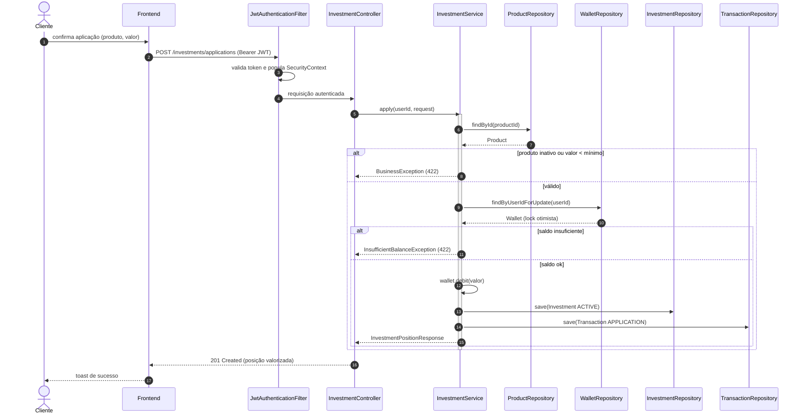
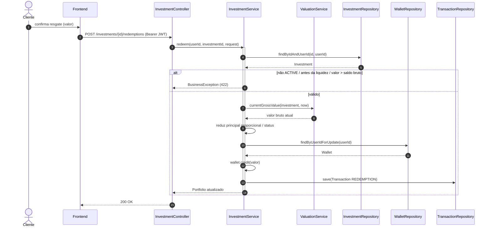
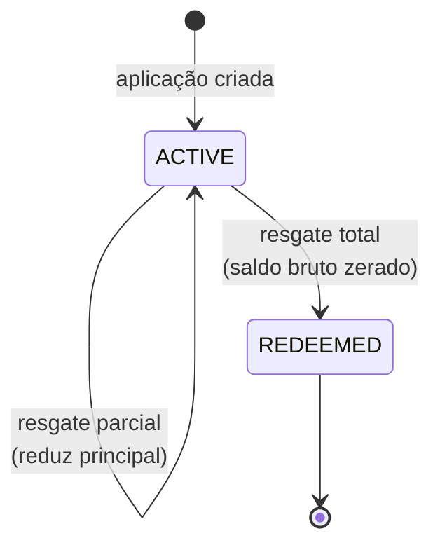

# Diagramas UML — ItauInvest

Diagramas em [Mermaid](https://mermaid.js.org/) (renderizam no preview do VS Code
e no GitHub). Refletem a implementação atual do código.

Índice:
1. [Diagrama de Casos de Uso](#1-diagrama-de-casos-de-uso)
2. [Diagrama de Classes (Domínio)](#2-diagrama-de-classes-dominio)
3. [Diagrama Entidade-Relacionamento (Banco)](#3-diagrama-entidade-relacionamento-banco)
4. [Diagrama de Componentes (Arquitetura em Camadas)](#4-diagrama-de-componentes-arquitetura-em-camadas)
5. [Sequência — Autenticação (Login)](#5-sequencia--autenticacao-login)
6. [Sequência — Aplicação em Produto](#6-sequencia--aplicacao-em-produto)
7. [Sequência — Resgate](#7-sequencia--resgate)
8. [Máquina de Estados — Investimento](#8-maquina-de-estados--investimento)

---

## 1. Diagrama de Casos de Uso

---

## 2. Diagrama de Classes (Domínio)

---

## 3. Diagrama Entidade-Relacionamento (Banco)

---

## 4. Diagrama de Componentes (Arquitetura em Camadas)

---

## 5. Sequência — Autenticação (Login)

---

## 6. Sequência — Aplicação em Produto

---

## 7. Sequência — Resgate

---

## 8. Máquina de Estados — Investimento

